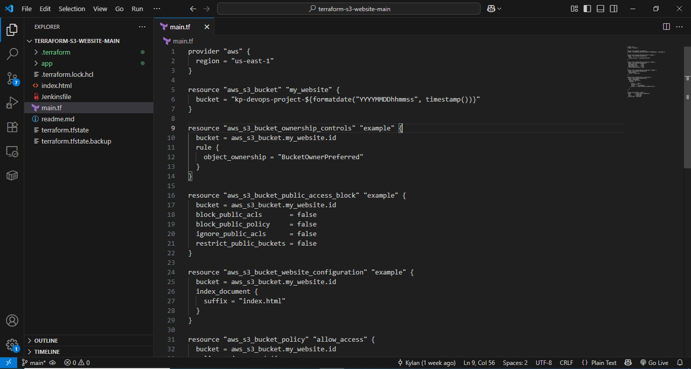
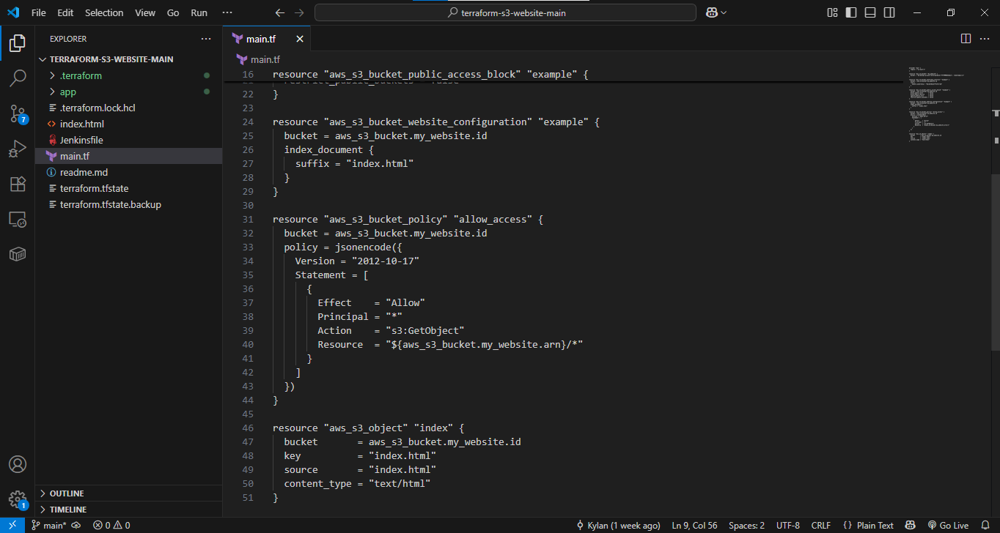

# portfolio-devops-project
# DevOps Portfolio Project: From Static Website to CI/CD Pipeline

## Project Evolution
This project demonstrates my DevOps skills by showing:
1. **Phase 1**: Manual static website deployment to AWS S3
2. **Phase 2**: Automated CI/CD pipeline with Jenkins

---

## Phase 1: Static Website (Manual Setup)
### What's Included
- HTML/CSS files for a personal portfolio
- Manual AWS S3 bucket configuration
- IAM security best practices

### Key Proofs
| Screenshot | Explanation |
|------------|-------------|
|  | Properly configured S3 bucket for static hosting |
|  | Properly configured S3 bucket for static hosting |

**Demonstarting foundational cloud skills before automation**

---

## Phase 2: CI/CD Automation (Jenkins Pipeline)
### Key Components
- Jenkins pipeline (`Jenkinsfile`)
- Python/Flask backend (`app.py`)
- Infrastructure as Code (`main.tf`)

### Pipeline Stages
1. **Code Quality Checks**: Pylint validation
2. **Dependency Management**: `requirements.txt`
3. **Automated Testing**: Unit tests
4. **Deployment Verification**: Smoke tests

### Proof of Automation
| Screenshot | Proof Point |
|------------|-------------|
|  | Automated build/test/deploy workflow |
|  | Infrastructure as Code execution |

---

## Professional Practices Demonstrated
✅ **Version Control**  
- Git branches & pull requests ([Proof](/screenshots/git-workflow.png))  
✅ **Security**  
- IAM roles with least privilege  
- S3 Block Public Access where applicable  
✅ **Documentation**  
- Clear project evolution tracking  

---

## How to Explore
1. Static website: Check `/static-site` folder
2. CI/CD pipeline: See `Jenkinsfile` and `/app`
3. AWS proofs: `/screenshots` folder

> **Recruiter Note**: This intentionally shows both manual and automated approaches to demonstrate skill progression.
